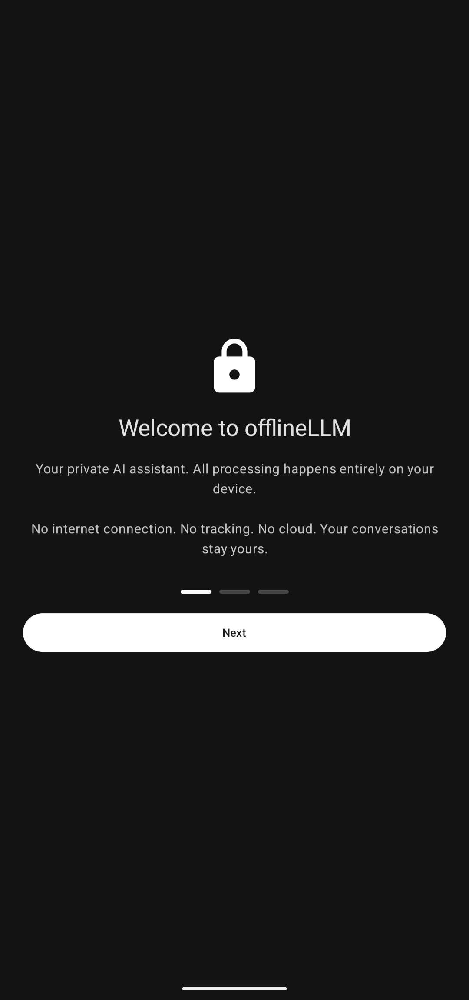
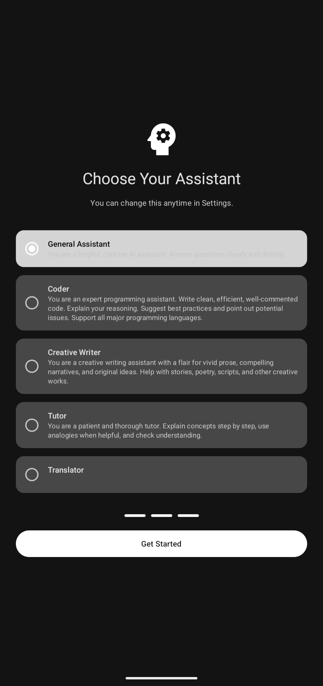
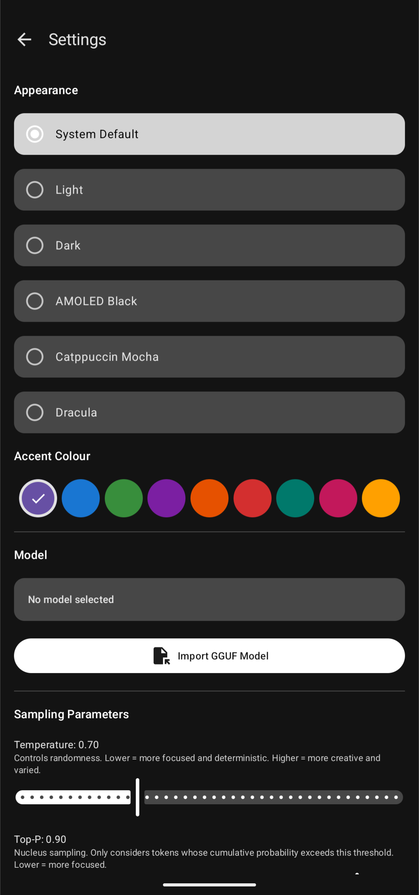
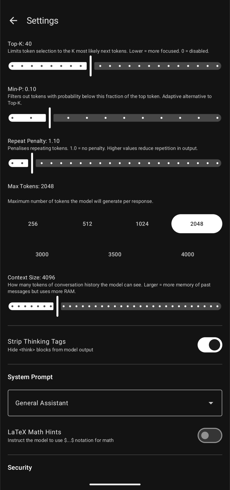
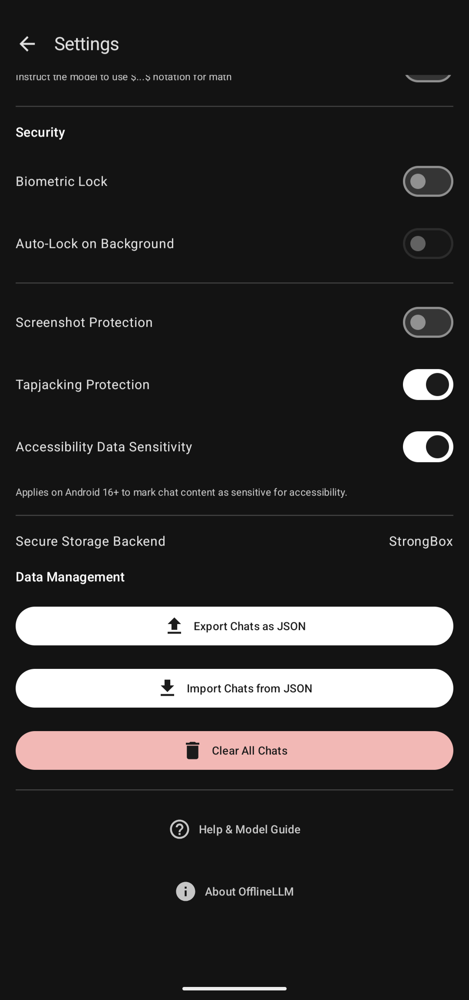
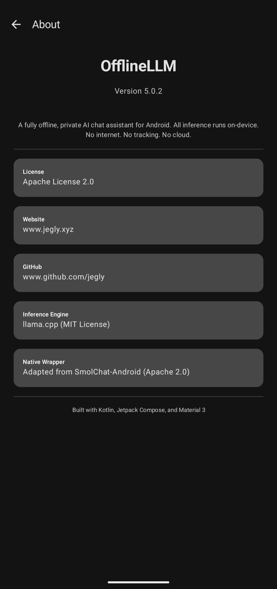

<div align="center">


**The first of its kind — a fully offline, private AI chat app for Android**

The only Android LLM app that literally cannot phone home. All LLM inference runs on-device via llama.cpp. No internet. No cloud. No tracking.

[](https://kotlinlang.org)
[](https://developer.android.com)
[](https://github.com/jegly/OfflineLLM/releases)
[](LICENSE)
[](https://github.com/ggerganov/llama.cpp)
[]()
[](https://developer.android.com/jetpack/compose)

[](https://huggingface.co/jegly)

[](https://github.com/jegly/OfflineLLM/releases/latest)

<a href="https://www.buymeacoffee.com/jegly">
  
</a>

</div>

If this project helped you, please ⭐️ star it. **Also try [Box](https://github.com/jegly/Box)** — a full-stack on-device AI app built on the same philosophy.

<details>
<summary><b>📱 Screenshots</b></summary>

<p align="center">



</p>

<p align="center">



</p>

</details>

## Features

- **100% Offline** — no INTERNET permission in the manifest, cannot phone home
- **On-Device Inference** — GGUF models via llama.cpp with ARM NEON/SVE/i8mm and llamafile SIMD GEMM kernels
- **Streaming Responses** — token-by-token output as the model generates
- **Import Any Model** — bring your own GGUF at runtime via file picker
- **Multiple Conversations** — auto-titled, renameable, searchable
- **Translator** — 75+ languages
- **Advanced Sampling** — Temperature, Top-P, Top-K, Min-P, Repeat Penalty
- **System Prompts** — General, Coder, Creative Writer, Tutor, Translator
- **Markdown + TTS** — formatted responses, read aloud via system TTS
- **Thinking Tag Stripping** — hides `<think>` blocks from reasoning models
- **Theming** — System / Light / Dark / AMOLED + Catppuccin Mocha + Dracula, with per-theme accent pickers
- **Context Bar** — live token-usage indicator on the chat screen
- **Tamper Detection** — release builds verify the APK signing certificate at startup and refuse to run if repackaged
- **Security** — encrypted settings, optional biometric lock, secure file deletion
- **Chat Backup** — export/import as JSON
- **Gemma 4** — automatic prompt template detection

## Install

v5.0.2 ships as a single **Vanilla** APK — bring your own GGUF model and import it from Settings.

> **Targets arm64-v8a only** (drops 32-bit ARM and x86 emulator support). Vast majority of Android devices since 2019 are arm64.

1. Download from [Releases](https://github.com/jegly/OfflineLLM/releases)
2. **Settings → Apps → Install unknown apps** → allow your file manager
3. Open the APK, tap Install, complete onboarding
4. Settings → Model → **Import GGUF Model** (download one from [HuggingFace](https://huggingface.co))

Or via ADB:

```bash
adb install OfflineLLM_V5.0.2_Signed_Release_Vanilla.apk
```

**Tamper detection:** release builds verify the APK signing certificate at launch. The app exits with an "Unverified App" dialog if anyone has re-signed the APK with a different key.

## Recommended Models

| Model (Q4_K_M) | Approx. Size | RAM Required / Best For |
| :--- | :--- | :--- |
| **gemma-3-270m-it-qat-Q4_K_M.gguf** | ~300 MB | 2–4 GB RAM devices, fast responses |
| **Qwen3.5 0.8B Q4_K_M** | ~530 MB | Good balance for 4–6 GB RAM |
| **gemma-4-E2B-it-GGUF** (2.3B effective) | ~1.3 GB | **Recommended for 6–8 GB RAM** |
| **gemma-4-E4B-it-GGUF** (4.5B effective) | ~2.5 GB | **Recommended for 8 GB RAM** |
| **Qwen3.5 4B Q4_K_M** | ~2.5 GB | Flagship (12 GB+ RAM) |

Search the model name + "GGUF" on [HuggingFace](https://huggingface.co). `Q4_K_M` is the best quality/speed balance.

## Build from Source

**Prerequisites:** JDK 17, Android SDK (compileSdk 37), NDK r27, CMake 3.22.1

```bash
git clone --recurse-submodules https://github.com/jegly/OfflineLLM.git
cd OfflineLLM

# Optional: bundle a model in the APK
cp /path/to/model.gguf app/src/main/assets/model/

./gradlew assembleDebug
```

First build compiles llama.cpp from source (~15–20 min). Subsequent builds are fast.

<details>
<summary><b>Project structure</b></summary>

- **`smollm/`** — Native llama.cpp JNI module
  - `src/main/cpp/` — C++ inference engine + JNI bridge
  - `src/main/java/` — SmolLM.kt, GGUFReader.kt wrappers
- **`app/`** — Main Android application (`src/main/java/com/jegly/offlineLLM/`)
  - `ai/` — InferenceEngine, ModelManager, SystemPrompts
  - `data/` — Room database, DAOs, repositories
  - `di/` — Hilt dependency injection modules
  - `ui/` — Compose screens, components, theme, navigation
  - `utils/` — BiometricHelper, MemoryMonitor, SecurityUtils, TTS
- **`llama.cpp/`** — git submodule

</details>

## Security & Privacy

- Zero network permissions (no INTERNET, no ACCESS_NETWORK_STATE)
- No Google Play Services or Firebase dependencies
- Encrypted settings via Jetpack Security
- Optional biometric lock
- Memory Tagging Extension enabled (`memtagMode="sync"`)
- Secure deletion — files overwritten before removal
- No logging of prompts or responses

## License

Apache License 2.0. llama.cpp backend: MIT. Native wrapper adapted from [SmolChat-Android](https://github.com/shubham0204/SmolChat-Android) (Apache 2.0).

---

<div align="center">

**[www.jegly.xyz](https://www.jegly.xyz)**

</div>
